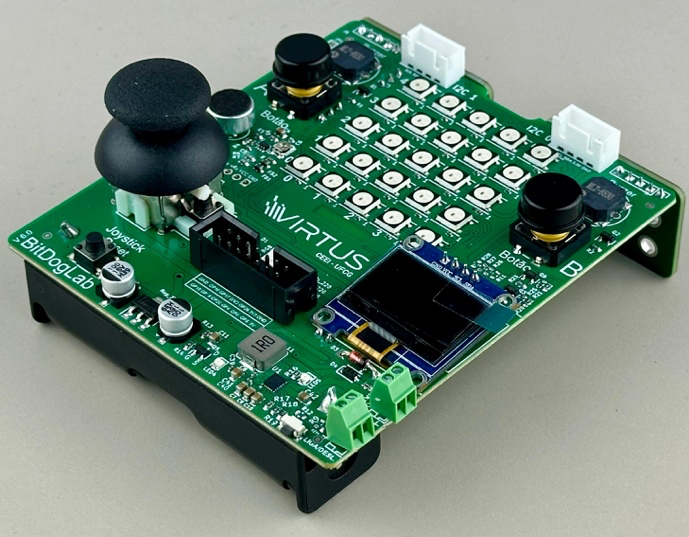

# Projeto de Controle de Buzzer na BitDogLab

## Autores

- Aryelson Gonçalves [https://github.com/aryelson1]
- Guilherme Santos [https://github.com/GuilhermexL]

Este projeto implementa um controle de buzzer utilizando a BitDogLab, com suporte para tons personalizados, melodias e interrupção via botão.

## Montagem do Projeto

## Hardware Utilizados

- Placa Bitdoglab
- Buzzer ativo/passivo
- Botões (para ativar e interromper o som)
- Jumpers e protoboard

## Conexões

- Buzzer: Pino GPIO21
- Botão 1: Pino GPIO5
- Botão 2: Pino GPIO6

## Funcionalidades

- Geração de sons utilizando PWM.
- Emissão de tons personalizados e melodias.
- Interrupção do som ao pressionar um botão.
- Reprodução do hino do Flamengo.

## Documentação das Funções

### `pwm_init_buzzer(uint pin)`
Inicializa o PWM no pino do buzzer.

### `setFrequency(uint pin, uint frequency)`
Define a frequência do som gerado pelo buzzer.

### `beepOn(uint pin, uint frequency)`
Liga o buzzer em uma frequência específica sem pausas.

### `beepOff(uint pin)`
Desliga o buzzer.

### `playTone(uint pin, uint frequency, uint duration_ms)`
Toca um tom por um tempo determinado.

### `playMelody(uint pin, uint melody[], uint durations[], uint length)`
Toca uma sequência de notas musicais.

### `countdown_beep(uint pin, uint count, uint interval)`
Executa uma contagem regressiva com beeps.

### `stop()`
Para qualquer som ativo no buzzer.

### `play_flamengo_anthem(uint pin)`
Toca o hino do Flamengo.

## Instruções

# Como Compilar e Executar

1. Requisitos:

- Visual Studio Code
- Extensão Rapsberry Pi Pico

2. Compilação:

- Importe o projeto pela interface da extensão e coloque a versão 1.5.1

3. Execução:

- Conecte a Raspberry Pi Pico ao computador via USB.
- Carregue o arquivo .uf2 gerado na Pico, ou instale o zadig para executar diretamente do VSCode.

4. Interação:

- Clique no botão para emitir som no Buzzer.

## Conclusão

## Referências

- Raspberry Pi Pico SDK [https://github.com/raspberrypi/pico-sdk]